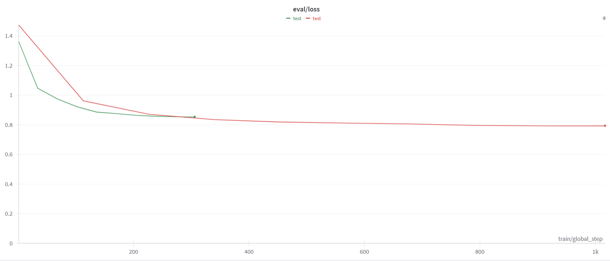
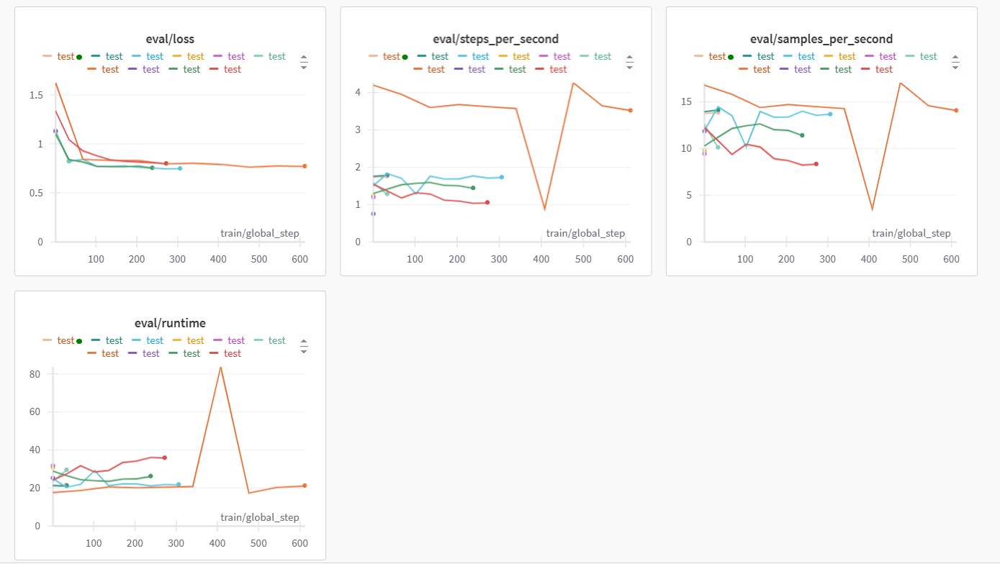
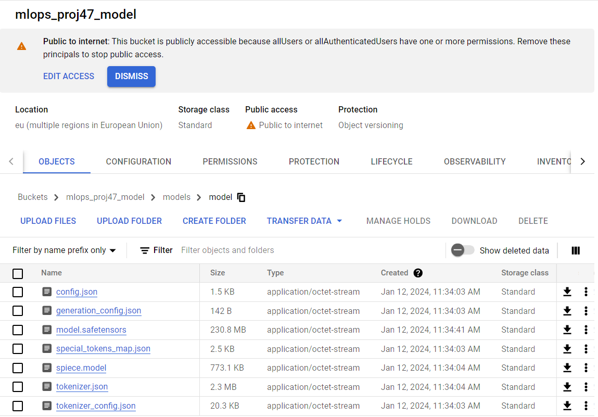
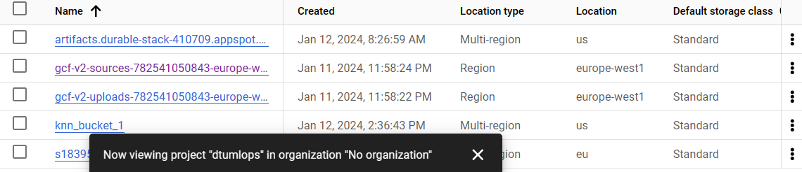
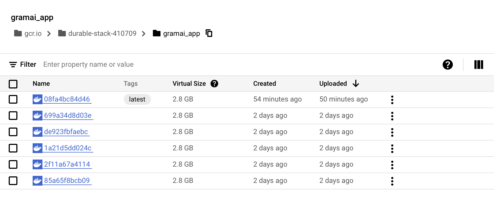
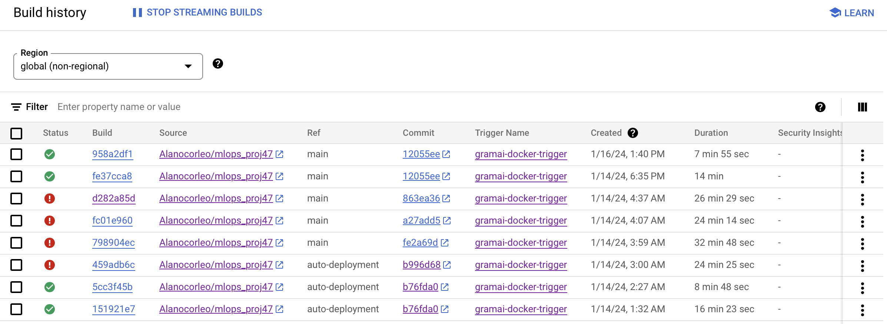

# Exam template for 02476 Machine Learning Operations

This is the report template for the exam. Please only remove the text formatted as with three dashes in front and behind
like:

```--- question 1 fill here ---```

where you instead should add your answers. Any other changes may have unwanted consequences when your report is auto
generated in the end of the course. For questions where you are asked to include images, start by adding the image to
the `figures` subfolder (please only use `.png`, `.jpg` or `.jpeg`) and then add the following code in your answer:

```markdown

```

In addition to this markdown file, we also provide the `report.py` script that provides two utility functions:

Running:

```bash
python report.py html
```

will generate an `.html` page of your report. After deadline for answering this template, we will autoscrape
everything in this `reports` folder and then use this utility to generate an `.html` page that will be your serve
as your final handin.

Running

```bash
python report.py check
```

will check your answers in this template against the constrains listed for each question e.g. is your answer too
short, too long, have you included an image when asked to.

For both functions to work it is important that you do not rename anything. The script have two dependencies that can
be installed with `pip install click markdown`.

## Overall project checklist

The checklist is *exhaustic* which means that it includes everything that you could possible do on the project in
relation the curricilum in this course. Therefore, we do not expect at all that you have checked of all boxes at the
end of the project.

### Week 1

* [x] Create a git repository
* [x] Make sure that all team members have write access to the github repository
* [x] Create a dedicated environment for you project to keep track of your packages
* [x] Create the initial file structure using cookiecutter
* [x] Fill out the `make_dataset.py` file such that it downloads whatever data you need and
* [x] Add a model file and a training script and get that running
* [x] Remember to fill out the `requirements.txt` file with whatever dependencies that you are using
* [x] Remember to comply with good coding practices (`pep8`) while doing the project
* [x] Do a bit of code typing and remember to document essential parts of your code
* [x] Setup version control for your data or part of your data
* [x] Construct one or multiple docker files for your code
* [x] Build the docker files locally and make sure they work as intended
* [x] Write one or multiple configurations files for your experiments
* [x] Use Hydra to load the configurations and manage your hyperparameters
* [ ] When you have something that works somewhat, remember at some point to to some profiling and see if
      you can optimize your code
* [x] Use Weights & Biases to log training progress and other important metrics/artifacts in your code. Additionally,
      consider running a hyperparameter optimization sweep.
* [ ] Use Pytorch-lightning (if applicable) to reduce the amount of boilerplate in your code

### Week 2

* [x] Write unit tests related to the data part of your code
* [x] Write unit tests related to model construction and or model training
* [x] Calculate the coverage.
* [x] Get some continuous integration running on the github repository
* [x] Create a data storage in GCP Bucket for you data and preferable link this with your data version control setup
* [x] Create a trigger workflow for automatically building your docker images
* [x] Get your model training in GCP using either the Engine or Vertex AI
* [x] Create a FastAPI application that can do inference using your model
* [ ] If applicable, consider deploying the model locally using torchserve
* [x] Deploy your model in GCP using either Functions or Run as the backend

### Week 3

* [ ] Check how robust your model is towards data drifting
* [ ] Setup monitoring for the system telemetry of your deployed model
* [ ] Setup monitoring for the performance of your deployed model
* [ ] If applicable, play around with distributed data loading
* [ ] If applicable, play around with distributed model training
* [ ] Play around with quantization, compilation and pruning for you trained models to increase inference speed

### Additional

* [x] Revisit your initial project description. Did the project turn out as you wanted?
* [x] Make sure all group members have a understanding about all parts of the project
* [x] Uploaded all your code to github

## Group information

### Question 1
> **Enter the group number you signed up on <learn.inside.dtu.dk>**
>
> Answer:

MLOps 47

### Question 2
> **Enter the study number for each member in the group**
>
> Example:
>
> *sXXXXXX, sXXXXXX, sXXXXXX*
>
> Answer:


s183955, s184191, s194819

### Question 3
> **What framework did you choose to work with and did it help you complete the project?**
>
> Answer length: 100-200 words.
>
> Example:
> *We used the third-party framework ... in our project. We used functionality ... and functionality ... from the*
> *package to do ... and ... in our project*.
>
> Answer:

We choose a couple of frameworks for the project. For the machine learning part, we used a framework call `HappyTransformer`. It is a library built on top of `HuggingFace`. It used for creating transformer models. We used a text-to-text transformer for our base model. The base model is pre-trained but is not trained for the grammar correction task. `HappyTransformer` was very helpful to complete the project. It simplifies model creation and training and integrates well with other tools we used like wandb. The library also gives a lot of good logging during the training so we have an idea of  We have also used Dash for creating an interface for the client app.

## Coding environment

> In the following section we are interested in learning more about you local development environment.

### Question 4

> **Explain how you managed dependencies in your project? Explain the process a new team member would have to go**
> **through to get an exact copy of your environment.**
>
> Answer length: 100-200 words
>
> Example:
> *We used ... for managing our dependencies. The list of dependencies was auto-generated using ... . To get a*
> *complete copy of our development environment, one would have to run the following commands*
>
> Answer:

We used `conda` for managing our dependencies. The list of dependencies was auto-generated using `pipreqs`. These depedencies were stored in requirements.txt. To get a complete copy of our development environment, one would have to run the following commands:

Assuming `conda` and `git` are already installed:
1. Clone the project: `git clone https://github.com/Alanocorleo/mlops_proj47.git`
2. Change the current directory: `cd mlops_proj47`
3. Create a conda enviroment (Python version can be obtained form pyproject.toml): `conda create --name <env_name> python=3.11.5`
4. Activate the created enviroment: `conda activate <env_name>`
5. Install all the required packages: `pip install -r requirements.txt`

requirements.txt is updated whenever there is change in the main branch. Thus, when working on a new branch, if the developer notices that some packages are missing from the enviroment, the developer is encoureged to install the packages using the file. `pip` would take care if some packages are missing or already exist.


### Question 5

> **We expect that you initialized your project using the cookiecutter template. Explain the overall structure of your**
> **code. Did you fill out every folder or only a subset?**
>
> Answer length: 100-200 words
>
> Example:
> *From the cookiecutter template we have filled out the ... , ... and ... folder. We have removed the ... folder*
> *because we did not use any ... in our project. We have added an ... folder that contains ... for running our*
> *experiments.*
> Answer:

From the cookiecutter template, we filled out the folders `src/data`, `src/models`, `data`, `models`, `tests`, `dockerfiles` and `reports`. We removed however `src/visualisations`, `docs` and `notebooks`. Since we were working with textual data, creating visualisations was not obvious. We also primarily relied on Python files; thus, Jupyter notebooks were not used. Moreover, we did not use MkDocs documentation framework. Instead, all information regarding our project was made available in the main README.md file, which containes a detailed description of the components and a short guide on how to use them. As for new folders, we added `src/assets`folder that contains all assets used in our graphical-based client app. Regarding the files given from the template (exluding those from the removed folders), all of them were filled and used. Moreover, new files were added such as gramai_app.py and app.py, as well as different requirements files, and cloudbuild.yaml. They were primarly used in cloud deployment.


### Question 6

> **Did you implement any rules for code quality and format? Additionally, explain with your own words why these**
> **concepts matters in larger projects.**
>
> Answer length: 50-100 words.
>
> Answer:

All team members have a software engineering background. Therefore, we were trying to apply software design principles such as Don't Repeat Yourself (DRY), Do One Thing (DOT), Keep It Simple Stupid (KISS), and You Aren't Gonna Need It (YAGNI). We also used `ruff` as our linter to analyze our code and to flag programming errors, bugs, and styling errors. All this can potentially reduce the possibility of bug occurence, while reducing the time spent to find a bug if occurred, in larger projects. Formatting also helps new developers in the team to understand the code easily.

## Version control

> In the following section we are interested in how version control was used in your project during development to
> corporate and increase the quality of your code.

### Question 7

> **How many tests did you implement and what are they testing in your code?**
>
> Answer length: 50-100 words.
>
> Example:
> *In total we have implemented X tests. Primarily we are testing ... and ... as these the most critical parts of our*
> *application but also ... .*
>
> Answer:

We implemented three unit tests using pytest for our code, specifically testing the main functionality in `make_data.py` and `train_model.py`. We test that `make_data.py` generates the processed dataset in the correct format, and that `train_model.py` trains and outputs a model after training. We focused on these scripts, as they lay the foundation of the final product.

### Question 8

> **What is the total code coverage (in percentage) of your code? If you code had an code coverage of 100% (or close**
> **to), would you still trust it to be error free? Explain you reasoning.**
>
> Answer length: 100-200 words.
>
> Example:
> *The total code coverage of code is X%, which includes all our source code. We are far from 100% coverage of our **
> *code and even if we were then...*
>
> Answer:

Our total code coverage is 93%, as we do not test `gramai_gapp.py` (front-end for the web-app) nor `gramai_app.py` (backend). We use a GitHub Action to check coverage of our tests, when merging with `main`, and we upload the result to codecov.io. Latest coverage result can be seen [here](https://app.codecov.io/gh/Alanocorleo/mlops_proj47). Even with 100% code coverage, we have no guarantee that the code is error-free. Code coverage is a measure of how many lines of the code is tested, not how many lines are error-free. In the end, only the quality of the test will determine how much faith one should put into the result, but it can serve as a useful metric to ensure that code is at least tested at all.

### Question 9

> **Did you workflow include using branches and pull requests? If yes, explain how. If not, explain how branches and**
> **pull request can help improve version control.**
>
> Answer length: 100-200 words.
>
> Example:
> *We made use of both branches and PRs in our project. In our group, each member had an branch that they worked on in*
> *addition to the main branch. To merge code we ...*
>
> Answer:

We made use of both branches and PRs in our project. In our group, each member had at least a branch to work on, contributing to the main branch. Every branch corresponded to a feature. For example, being able to deploy an app on cloud automatically requires \<name\>.dockerfile as well as cloudbuild.yaml, which should contain the steps needed for doing so. This is considered as a feature. The feature must be functional before merging with main. If multiple components are involved, then a branch from main can be considered as an enabler, and further branches as features. To merge code, we always pulled the main branch, merged locally with the feature branch, and then pushed all changes to the feature branch on Github. On Github, a branch protection rule was applied to merge with main. This included:

- Require a pull request before merging
- Require at least 1 approval
- Require status checks to pass before merging
- Require conversation resolution before merging

When all checks are passed, merging is allowed. This helped to keep the main code always functional.

### Question 10

> **Did you use DVC for managing data in your project? If yes, then how did it improve your project to have version**
> **control of your data. If no, explain a case where it would be beneficial to have version control of your data.**
>
> Answer length: 100-200 words.
>
> Example:
> *We did make use of DVC in the following way: ... . In the end it helped us in ... for controlling ... part of our*
> *pipeline*
>
> Answer:

We have not used DVC for managing data in the project. However, we have used it for managing models. In our project, the model files have a size of about 300MB where as the data is about 3MB. We can easily version control the data with git as it is provided in a CSV file. The model files on the other hand cannot be version controlled by github as they exceed 100MB size threshhold. On the other hand, dvc allows us to version control the model. If one of the group members gets lucky with their hyperparameters and produces a great model. They can use dvc so that is is accessible to all group members with a simple dvc pull command.

### Question 11

> **Discuss you continues integration setup. What kind of CI are you running (unittesting, linting, etc.)? Do you test**
> **multiple operating systems, python version etc. Do you make use of caching? Feel free to insert a link to one of**
> **your github actions workflow.**
>
> Answer length: 200-300 words.
>
> Example:
> *We have organized our CI into 3 separate files: one for doing ..., one for running ... testing and one for running*
> *... . In particular for our ..., we used ... .An example of a triggered workflow can be seen here: <weblink>*
>
> Answer:

We have organized our CI into 3 separate files: one for checking if the code is PEP8 compliant via Ruff linter [codecheck.yaml](https://github.com/Alanocorleo/mlops_proj47/blob/main/.github/workflows/codecheck.yaml), one for checking if the code passes all unit tests [test.yaml](https://github.com/Alanocorleo/mlops_proj47/blob/main/.github/workflows/tests.yml), and one for checking the code coverage and uploading a report to Codecov [coverage.yaml](https://github.com/Alanocorleo/mlops_proj47/blob/main/.github/workflows/coverage.yaml). For testing, we use caching and code coverage, since there're a lot of dependencies and the sizes of some packages are significantly large. An example of a triggered workflow can be seen here: https://github.com/Alanocorleo/mlops_proj47/actions/runs/7545186644/job/20540236825. We also check for multiple operating systems: `ubuntu-latest`, `windows-latest`, `macos-latest`. Another part is related to the cloud. Whenever the main branch is updated, a build gets triggered. `cloudbuild.yaml` is used by Cloud Build on GCP to get the steps required for creating, storing and deploying a container in a continues manner. All logs from the build process are sent to Github. In this way, if the build fails on cloud, all developers would get notified. With this setup, CI automates the integration of code changes from every group member into a single consistent project. It improves the quality and the speed of delivery by providing fast feedback, reducing errors, limiting manual tasks, and ensuring consistent builds, enabling efficiency and productivity in work.


## Running code and tracking experiments

> In the following section we are interested in learning more about the experimental setup for running your code and
> especially the reproducibility of your experiments.

### Question 12

> **How did you configure experiments? Did you make use of config files? Explain with coding examples of how you would**
> **run a experiment.**
>
> Answer length: 50-100 words.
>
> Example:
> *We used a simple argparser, that worked in the following way: python my_script.py --lr 1e-3 --batch_size 25*
>
> Answer:

We used hydra for configuring the parameters of our experiments in config files. Each experiment has it's own config file. We specify which config file we want to use by specifying the file name when running the python script. `python -u src/train_model.py training=training_fast2`. We have a training config that includes training hyperparameters like lr, epochs, batch size and so one. We also have one for making data as we can choose the size of the dataset we want to download and process.

### Question 13

> **Reproducibility of experiments are important. Related to the last question, how did you secure that no information**
> **is lost when running experiments and that your experiments are reproducible?**
>
> Answer length: 100-200 words.
>
> Example:
> *We made use of config files. Whenever an experiment is run the following happens: ... . To reproduce an experiment*
> *one would have to do ...*
>
> Answer:

In order for the experiments to be reproducable we need to insure we are using the same hyperparameters (including the seed). Moreover, it is important to be running the experiements in docker containers or a compute engine instance with the same configuration. This ensures no system variabilities modify the experiment results. We also need to use the same python version and packages versions. The perfect way to ensure all the above information is not lost is to save hyperparameters in config files, package versions in requirements files and dockerfiles for images. Finally, to ensure that the experiements are indeed reproducable we compare the results of the graph produced by wandb when running the same experiment twice. We are mostly interested in comparing the eval loss, training loss and not machine performance metrics. We cannot compare the weights of the models because the lirary we are using (happytransformer) abstracts the model tensors from us.

### Question 14

> **Upload 1 to 3 screenshots that show the experiments that you have done in W&B (or another experiment tracking**
> **service of your choice). This may include loss graphs, logged images, hyperparameter sweeps etc. You can take**
> **inspiration from [this figure](figures/wandb.png). Explain what metrics you are tracking and why they are**
> **important.**
>
> Answer length: 200-300 words + 1 to 3 screenshots.
>
> Example:
> *As seen in the first image when have tracked ... and ... which both inform us about ... in our experiments.*
> *As seen in the second image we are also tracking ... and ...*
>
> Answer:

The first metric we were interested in improving is the training time. Even if it comes at a slight quality loss. This way we can focus on experiments and run automated tasks withtout having to wait for a long time.

The red graph is for a model trained on 10000 data points while the green is trained on 3000. The red takes more than 3 times the time to train than the green while not having any substantial difference in eval loss. So, based on this experiment, we decided to run future expriements on 3000 data points to speed up the experiement times and reduce the loop of debugging in the cloud if some wrong happens.

The following shows results from running a bunch of experiments:



A lot of experiements we ran ended up failing mostly due to hardware failures (out of memory or networking issues due wandb sending data). These failures occured both locally and in the cloud experiments. Such experiments would have a high batch size for example or high epochs. On the other hand, the experiments that have succeded have not produced substantially different models. We mostly compare the eval/loss as it is the metric we can track while the experiment is going on. However, if we want to do a hyperparameter sweep we need to take the validation loss instead as the key metric to minimize for. We tried a sweep with wandb but it failed due to performance issues.
### Question 15

> **Docker is an important tool for creating containerized applications. Explain how you used docker in your**
> **experiments? Include how you would run your docker images and include a link to one of your docker files.**
>
> Answer length: 100-200 words.
>
> Example:
> *For our project we developed several images: one for training, inference and deployment. For example to run the*
> *training docker image: `docker run trainer:latest lr=1e-3 batch_size=64`. Link to docker file: <weblink>*
>
> Answer:

We used docker to run our expreriments. We would run the docker image with a command like `docker run  -e WANDB_API_KEY=ourkeygoeshere train:latest training=training_fast`. The nice thing about using docker is that we do not loss our ability to use wandb or specify config files. We log into wandb by specifying an API key in an enviroment variable. We also specify the config file to use for the specific experiment. Our dockerfile for training can be found [here](./../dockerfiles/train_model.dockerfile). Nothing special is done in our dockerfile. We mostly copy things over and install requirements. If we are interesed in saving the model after training we can simply mount our models directory so we do not have to copy the model over after the experiment.

### Question 16

> **When running into bugs while trying to run your experiments, how did you perform debugging? Additionally, did you**
> **try to profile your code or do you think it is already perfect?**
>
> Answer length: 100-200 words.
>
> Example:
> *Debugging method was dependent on group member. Some just used ... and others used ... . We did a single profiling*
> *run of our main code at some point that showed ...*
>
> Answer:

We encountered many bugs during our experiment runs. We performed debugging mainly through logging. Our code produces logs on our training progress. Whenever we have a failure we can read the error messages and get an idea of what the bug was. We also setup tests to be able to isolate and detect bugs mostly after merging branches and adding new changes. We have not really tried profiling. Not because our code is already perfect but because the code from the libraries we are using is where most of our experiment time is spent. So optimizing our code will have negligible effects.

## Working in the cloud

> In the following section we would like to know more about your experience when developing in the cloud.

### Question 17

> **List all the GCP services that you made use of in your project and shortly explain what each service does?**
>
> Answer length: 50-200 words.
>
> Example:
> *We used the following two services: Engine and Bucket. Engine is used for... and Bucket is used for...*
>
> Answer:

We primarily used the following services: Compute Engine, Cloud Run, Cloud Build, Cloud Storage, and Container Registry.

- **Compute Engine** allows running virtual machines (VMs) on Google's cloud. By choosing the configuration of CPU, memory, GPU, disk, OS, and the needed software to run on the VMs, this service provides everything necessary to perform training on cloud.

- **Cloud Run** allows running containers on a fully managed serverless platform. By deploying a container to Cloud Run, it will handle the hosting, scaling, and networking.

- **Cloud Build** is a serverless continuous integration, delivery, and deployment platform that allows running fast, consistent, reliable automated builds. It can be used with Triggers to automatically trigger builds.

- **Cloud Storage** allows storing and accessing data and large models on Google's cloud. Buckets are used to store large datasets and models. This service can be integrated with other GCP services, such as Compute Engine, Cloud Run, Cloud Functions and dvc.

- **Container Registry** is a repository of container images and artifacts for Kubernetes, DevOps, and container-based application development. We used Container Registry to store, secure, scan, and manage our container images.

### Question 18

> **The backbone of GCP is the Compute engine. Explained how you made use of this service and what type of VMs**
> **you used?**
>
> Answer length: 100-200 words.
>
> Example:
> *We used the compute engine to run our ... . We used instances with the following hardware: ... and we started the*
> *using a custom container: ...*
>
> Answer:

Compute engine is the backbone of GCP. We used Compute Engine to run our training. We tried both cpu and gpu training. For the cpu we used pytorch-latest-cpu image family. For gpu we used pytorch-latest-cpu image family.`-accelerator="type=nvidia-tesla-v100,count=1`There was some issue with gpu driver and the pytorch version used by our framework not being compatible. So we only trained our models on cpu. Once we are on the VM we git clone our project pip install the requirements then run the experiments. We can also use wandb in the VM by providing the key when asked for it. However, the training was as slow as on our machines so it did not help much.
### Question 19

> **Insert 1-2 images of your GCP bucket, such that we can see what data you have stored in it.**
> **You can take inspiration from [this figure](figures/bucket.png).**
>
> Answer:




### Question 20

> **Upload one image of your GCP container registry, such that we can see the different images that you have stored.**
> **You can take inspiration from [this figure](figures/registry.png).**
>
> Answer:



### Question 21

> **Upload one image of your GCP cloud build history, so we can see the history of the images that have been build in**
> **your project. You can take inspiration from [this figure](figures/build.png).**
>
> Answer:



### Question 22

> **Did you manage to deploy your model, either in locally or cloud? If not, describe why. If yes, describe how and**
> **preferably how you invoke your deployed service?**
>
> Answer length: 100-200 words.
>
> Example:
> *For deployment we wrapped our model into application using ... . We first tried locally serving the model, which*
> *worked. Afterwards we deployed it in the cloud, using ... . To invoke the service an user would call*
> *`curl -X POST -F "file=@file.json"<weburl>`*
>
> Answer:

For deployment we wrapped our model into an application using FastAPI. We created a trigger using Triggers, a feature provided by Cloud Build service, on GCP, and a `cloudbuild.yaml` file, specifying the steps needed: creating an image using `dockerfiles/gramai_app.dockerfile`, creating a container by running the image, pushing this container to Container Registry, and then deploy it using Cloud Run. To invoke the service, let's assume a user would like to check the correctness of the following sentence: *"He have a car"*. Hence, a user would call

Curl:
`curl -X 'POST' 'https://gramai-app-h2yv3342wq-ew.a.run.app/text/?input_sentence=He%20have%20a%20car'`

A response would be:
`{"corrected":"He has a car."}%`

We took another approach by designing and creating an app with user interface. We also deployed it ([GramAI](https://gramai-gapp-h2yv3342wq-ew.a.run.app/)). The following screenshot shows how it should look like:


A user interface provides a more intuitive way to interact with our deployed model.

### Question 23

> **Did you manage to implement monitoring of your deployed model? If yes, explain how it works. If not, explain how**
> **monitoring would help the longevity of your application.**
>
> Answer length: 100-200 words.
>
> Example:
> *We did not manage to implement monitoring. We would like to have monitoring implemented such that over time we could*
> *measure ... and ... that would inform us about this ... behaviour of our application.*
>
> Answer:

We used `prometheus-fastapi-instrumentator` to allow us to easily instrument our FastAPI application with Prometheus to setup monitoring. We exposed the metrics on the `/metrics` endpoint of our deployed app. We also setup a Prometheus sidecar container for Cloud Run that scrapes metrics from port 8080 every 30 seconds. To automate some monitoring procedures, we created a policy called "Exceeding limit of expected requests" as part of alerting, which triggers email sending with a warning message to a notification group when the number of requests to our API exceeds some specified limit. The target we selected is "PROMETHEUS TARGET - PROMETHEUS/HTTP_REQUESTS_TOTAL/COUNTER". All data points in the most recent rolling window (5 min) combined together by using the aggregation function (rate) to form a single point. This helps to control whether our application gets too many requests than normal.

### Question 24

> **How many credits did you end up using during the project and what service was most expensive?**
>
> Answer length: 25-100 words.
>
> Example:
> *Group member 1 used ..., Group member 2 used ..., in total ... credits was spend during development. The service*
> *costing the most was ... due to ...*
>
> Answer:

Group member 1 used 6.67$. Another group memeber used 3.64$. In total around 10$ credits was spend during development. The service costing the most was Compute Engine due to having instances running, especially for training. The instances must be stopped after finishing working with them; otherwise, they can consume credits. This is different to Cloud Run, which we used for deploying our app. It requires payment for the resources only when the deployed container is invoked and running.


## Overall discussion of project

> In the following section we would like you to think about the general structure of your project.

### Question 25

> **Include a figure that describes the overall architecture of your system and what services that you make use of.**
> **You can take inspiration from [this figure](figures/overview.png). Additionally in your own words, explain the**
> **overall steps in figure.**
>
> Answer length: 200-400 words
>
> Example:
>
> *The starting point of the diagram is our local setup, where we integrated ... and ... and ... into our code.*
> *Whenever we commit code and puch to github, it auto triggers ... and ... . From there the diagram shows ...*
>
> Answer:

The following diagram gives an overview of the overall architecture of our system and what services we make use of:


The process begins with a developer making a pull request on GitHub. The pull request triggers a series of actions that involve code review and checks before it is merged into the main repository. Before merging is allowed, ruff check and tests have to run successfully. Code Coverage is also calculated and updated.

After the merge, the workflow initiates automated tasks that include building a Docker image of the application and pushing it to the Container Registry. This part of the process involves tools like Cloud Build for creating project-based images and pushing them to storage.

DVC (Data Version Control) plays an essential role in managing and versioning datasets and machine learning models. It interacts with Cloud Storage (Bucket), ensuring that data is appropriately stored and versioned.

The experiments can be ran both in VertexAI and Compute Engine. Hydra is used for configuring experiments. Wandb is used to see metrics from the experiments.

The final steps involve deploying the application using Cloud Run, which allows for fully managed applications in containers on Google Cloud Platform. Monitoring these applications is done through Cloud Monitoring to ensure optimal performance and availability.
### Question 26

> **Discuss the overall struggles of the project. Where did you spend most time and what did you do to overcome these**
> **challenges?**
>
> Answer length: 200-400 words.
>
> Example:
> *The biggest challenges in the project was using ... tool to do ... . The reason for this was ...*
>
> Answer:

The biggest challenge in the project was working with new tools and frameworks - those we have no prior experience with. In particular, when working on cloud, there were lots of issues when we tried to setup the deployment pipeline. Some scripts provided from the exercises were not working as intended. Therefore, we had to read GCP documentation and try out different examples from the available guides before we could identify any issue. This helped us gaining a better understanding of how different components are connected and interact with each other on GCP. One problems that we had was not being able to automatically deploy a container. Apparently, after doing some research, a large docker file can cause problems. In our case, the size is around 3.6 GB. Despite our efforts in optimizing and reducing the overall size by keeping only the necessary files and folders, it didn't work. The alternative solution that solved our problem was basically specifying the machine name which should handle all of the processing. The more capable the machine, the better it can handle large files. One of the other major problems we had is to train with compute engine using GPU. The main reason was that a gpu driver update was needed. It was quite challenging to do that with only an ssh connection. The other solution would have been to downgrade our pytorch version but that is out of our control as the framework built on top has control over it. It was also challenging to deal with debugging build failures. Our containers work locally but fail in the cloud and the cloud logs and error messages are very vague and imprecise. So, we do not really know what is exactly going wrong. Most fixes have been through blind trial and error but we eventually solved build problems.

### Question 27

> **State the individual contributions of each team member. This is required information from DTU, because we need to**
> **make sure all members contributed actively to the project**
>
> Answer length: 50-200 words.
>
> Example:
> *Student sXXXXXX was in charge of developing of setting up the initial cookie cutter project and developing of the*
> *docker containers for training our applications.*
> *Student sXXXXXX was in charge of training our models in the cloud and deploying them afterwards.*
> *All members contributed to code by...*
>
> Answer:

Student s183955 was in charge of setting up the project with cookie cutter, configuring protection rules on Github, creating a continuous integration (CI) setup, creating docker files for app deployment, buidling a pipeline for app deployment on cloud, creating a graphical app for clients, and setting up monitoring.

s184191 was in charge of setting up the initial data pipeline and model framework with HappyTransformer, W&B, and Hydra. Documenting, logging, typing, and unittesting the main Python scripts, as well as pre-commit setup.

s194819 was in charge of developing of the docker containers for training our applications, configuring experiments and setting up the reporting to wandb inside container, local and cloud runs. Running experiements both locally and in cloud. Setting up dvc for model versioning and linking it to google cloud buckets.
